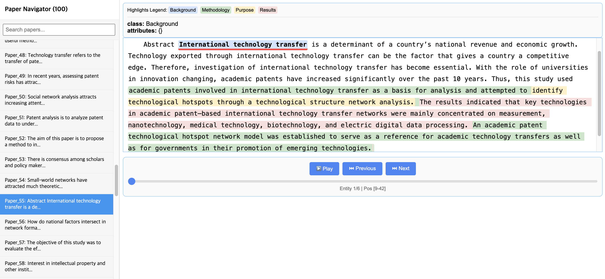

# **Scientific Paper Info Extractor & Graph Builder (Advanced)**

This tool extracts structured information (Background, Purpose, Methodology, Results) from paper abstracts using Ollama LLMs, constructs a **Node/Edge Lists of Knowledge Graph** through semantic analysis, and generates an interactive multi-document visualization dashboard.

Recent updates include **Pydantic-based strict data validation**, **Advanced Entity Resolution**, and **Multiprocessing-based high-performance visualization**.

---

## **✨ Key Features**

1. **Structured Extraction (with Pydantic)**:  
   * Enforces the LLM to strictly adhere to a defined JSON schema using Pydantic.  
   * Prevents common issues like missing fields or malformed JSON, ensuring data integrity.  
2. **Advanced Entity Resolution**:  
   * Goes beyond simple text matching by using **Embeddings** and **LLM Canonicalization** to merge synonyms.  
   * *Example: "CNN", "ConvNet", "Convolutional Neural Network" → Normalized to "Convolutional Neural Network".*  
3. **High-Performance Visualization**:  
   * Implements **Multiprocessing** for the computationally expensive text alignment task, significantly speeding up the processing of large datasets.  
4. **Auto-Thresholding Graph**:  
   * Dynamically adjusts the similarity threshold based on the data distribution to create an optimal network structure (avoiding hairball graphs).

---

## **🚀 Setup**

Requires Python 3.8+. Install the dependencies:

Bash

pip install pandas numpy pyyaml tqdm langextract pydantic networkx ollama

* **Prerequisites**:  
  * [Ollama](https://ollama.com/) must be installed and running (ollama serve).  
  * Pull the required models (e.g., your selected LLM and the embedding model):  
    Bash  
    ollama pull gpt-oss:120b-cloud  
    ollama pull nomic-embed-text

---

## **💻 Usage**

1. Configuration (config.yaml):  
   Set your input file path, selected models, and similarity thresholds.  
2. **Run**:  
   Bash  
   python3 src/main.py \--config config.yaml

---

## **📊 Output**

Results are saved in Output/generated/:

* **CSV Files** (for Graph Database/RAG):  
  * papers.csv: Paper nodes.  
  * entities.csv: Canonicalized entity nodes (Background, Methodology, etc.).  
  * relations.csv: Relationships (Paper-Entity and Entity-Entity similarity).  
* **Visualization**:  
  * graph\_visualization.html: **Main Dashboard**. Open this in your browser to explore the papers and graph.  
  * extraction\_results.jsonl: The raw extracted and aligned data.

---

## **🖼️ Visualization Example**



---

## **🧠 System Logic & Algorithms**

### **1\. Extraction Logic (src/extractor.py)**

* **Schema Enforcement**: Uses Pydantic models to inject a strict JSON schema into the system prompt.  
* **Validation**: Automatically validates the LLM output. If the output violates the schema (e.g., wrong data type), it handles the error to ensure only valid data enters the pipeline.

### **2\. Graph Builder Logic (src/graph\_builder.py)**

This module refines knowledge rather than just connecting text.

* **Entity Resolution**:  
  1. **Embedding**: Calculates vector embeddings for all extracted entities.  
  2. **Semantic Clustering**: Groups semantically similar entities using Cosine Similarity and NetworkX (Connected Components).  
  3. **Canonicalization (LLM)**: Asks the LLM to select or generate the most standard scientific term (Canonical Name) for each cluster.  
  4. **Merge**: Replaces original text with the canonical name in the graph, effectively removing duplicates.  
* **Semantic Relation**:  
  * Connects entities based on semantic similarity, using dynamic thresholding (similarity.mode: "auto") to keep only the top N% of strongest connections.

### **3\. Visualizer Logic (src/visualizer.py)**

* **Parallel Alignment**:  
  * The process of mapping extracted text back to the exact character indices in the source abstract is CPU-intensive.  
  * We use ProcessPoolExecutor to parallelize this task across all available CPU cores, drastically reducing processing time.  
* **Multi-Document Player**:  
  * Generates a unified HTML dashboard with a searchable sidebar and an embedded document viewer using the langextract library.

---

## **📂 File Structure**

```text
.
├── Input
│   └── rawdata.csv              # Input CSV containing abstracts
├── Output
│   └── generated/               # Generated results (HTML, CSV, JSONL)
├── src
│   ├── main.py                  # Entry point
│   ├── extractor.py             # Pydantic-based structured extraction
│   ├── graph_builder.py         # Entity Resolution & Graph Construction
│   ├── visualizer.py            # Multiprocessing Visualization Engine
│   └── ollama_client.py         # Ollama API Wrapper
├── config.yaml                  # Configuration file
└── README.md                    # Documentation
```

---

## System Architecture

%% 스타일 정의
    classDef input fill:#f9f,stroke:#333,stroke-width:2px,color:black;
    classDef module fill:#e1f5fe,stroke:#0277bd,stroke-width:2px,color:black;
    classDef logic fill:#fff9c4,stroke:#fbc02d,stroke-width:2px,stroke-dasharray: 5 5,color:black;
    classDef storage fill:#e0f2f1,stroke:#00695c,stroke-width:2px,color:black;
    classDef output fill:#dcedc8,stroke:#558b2f,stroke-width:2px,color:black;

    %% 1. 입력 단계
    Input([📄 Raw Text<br/>논문 초록 Abstract]):::input
    
    %% 2. Extraction 단계
    subgraph S1 [Phase 1: Extraction]
        direction TB
        Extractor(extractor.py):::module
        LLM{LLM + Pydantic}:::logic
        DataStruct[구조화된 JSON<br/>Background, Purpose,<br/>Methodology, Results]:::storage
        
        Input --> Extractor
        Extractor --> LLM
        LLM -- Schema Parsing --> DataStruct
    end

    %% 3. Graph Builder 단계
    subgraph S2 [Phase 2: Graph Building]
        direction TB
        Builder(graph_builder.py):::module
        ER{Entity Resolver<br/>임베딩 유사도 분석}:::logic
        Files[CSV Files<br/>Nodes & Edges]:::storage
        
        DataStruct --> Builder
        Builder -- Node/Edge 생성 --> ER
        ER -- 동의어 통합 (Canonicalization) --> Files
    end

    %% 4. Visualizer 단계
    subgraph S3 [Phase 3: Visualization]
        direction TB
        Vis(visualizer.py):::module
        Aligner{Word Aligner<br/>원본-추출 텍스트 매핑}:::logic
        HTML[Interactive HTML<br/>Highlighting UI]:::output

        Files --> Vis
        Input -.-> Vis
        Vis --> Aligner
        Aligner --> HTML
    end

    %% 흐름 연결
    S1 ==> S2
    S2 ==> S3

## **License**

MIT License
